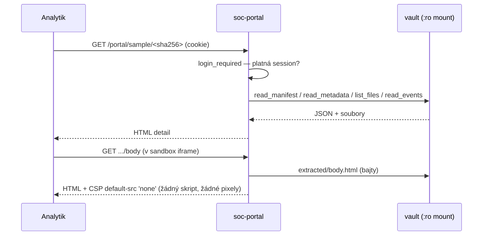
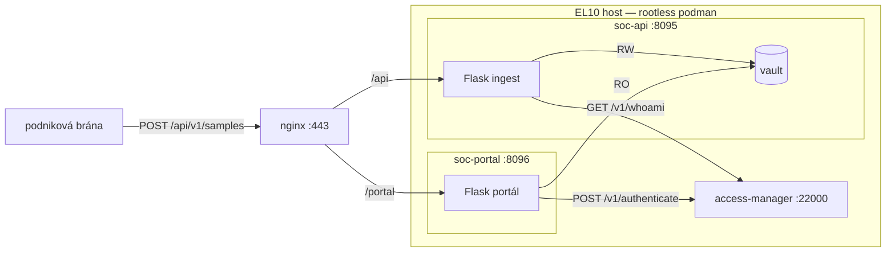

# soc-portal — implementace, principy a rozhodnutí

Webové okno SOC týmu do analyzovaných vzorků. Samostatná komponenta vedle
`soc-api` (příjem) a budoucího orchestrátoru analýzy. Portál je **jen ke čtení**:
zobrazuje, netriaguje data ve vaultu.

## 1. Vrstvy (vertikální řez — jádro nezná HTTP)

```
soc_mail/             SDÍLENÁ KNIHOVNA (vlastní balíček, víc komponent — ne monolit):
│                     msg.py čtení .msg · defang.py zneškodnění obsahu ·
│                     headers.py offline analýza hlaviček (viz header-analysis.md);
│                     žádný Flask/vault/HTTP, viz ADR-9
soc_portal/
├─ config.py          všechny volby z prostředí; fail-fast validace na startu
├─ logging_setup.py   strukturované JSON logy (stejný tvar jako soc-api / AM)
├─ vault_reader.py    DOMÉNA dat — read-only čtení vaultu (zrcadlí soc_api.storage)
├─ auth/              DOMÉNA identity — bez frameworku, testovatelné bez sítě
│   ├─ provider.py        rozhraní AuthProvider + modely Identity / AuthResult
│   ├─ mock.py            MockAuthProvider (jindrich/demo) — vývoj/demo
│   ├─ access_manager.py  AccessManagerAuthProvider — reálný TOTP proti AM
│   ├─ session.py         naše server-side session (abs + idle TTL)
│   └─ authz.py           brána: členství ve skupině (autentizace ≠ autorizace)
└─ web/               PREZENTACE — tenká slupka nad Flaskem
    ├─ app.py             kompoziční kořen: sestaví app, vloží provider
    ├─ deps.py            login_required guard, klient IP
    ├─ routes_auth.py     /login, /logout
    ├─ routes_samples.py  /, /sample/<sha>, .../body, .../nested/<i>/body, .../file/<p>
    └─ templates/, static/
```

Záměna `mock` ⇄ reálný AM je **jeden řádek** v `build_provider()`. Celý portál
tak jde postavit a otestovat dřív, než máme klíč k access-manageru.

## 2. Datový tok

### Přihlášení
```mermaid
sequenceDiagram
    participant U as Analytik (prohlížeč)
    participant N as nginx (TLS)
    participant P as soc-portal (waitress)
    participant AM as access-manager

    U->>N: POST /portal/login (username, TOTP)
    N->>P: proxy + X-Forwarded-For, X-Forwarded-Prefix=/portal
    P->>AM: POST /v1/authenticate {username, credentials.totp, purpose:"login", client_origin}
    AM-->>P: {outcome, subject_id, principals, gen}
    alt outcome=ok A group:users v principals
        P->>P: session.establish() → podepsaná cookie (8h abs / 30m idle)
        P-->>U: 302 /portal/  (Set-Cookie: HttpOnly, Secure, SameSite=Lax)
    else denied / throttled / neoprávněn
        P-->>U: login znovu (obecná hláška; detail jen do logu)
    end
```

### Zobrazení vzorku


### Komponenty


## 3. Konfigurace (vše z prostředí — žádné magické hodnoty)

| Proměnná | Výchozí | Význam |
|---|---|---|
| `SOC_PORTAL_VAULT` | `/vault` | read-only mount vaultu |
| `SOC_PORTAL_AUTH_BACKEND` | `mock` | `mock` \| `access_manager` |
| `SOC_PORTAL_AM_URL` | `http://127.0.0.1:22000` | access-manager |
| `SOC_PORTAL_AM_KEY` | — | **token aplikace** (povinný pro `access_manager`) |
| `SOC_PORTAL_REALM` | `soc.autumnpartials.com` | ověřeno na startu přes `/v1/whoami` |
| `SOC_PORTAL_REQUIRED_GROUP` | `users` | uživatel musí být `group:<...>` |
| `SOC_PORTAL_SESSION_SECRET` | — | **povinný** (podpis cookie, ≥16 znaků) |
| `SOC_PORTAL_SESSION_ABS_TTL_S` | `28800` | absolutní strop session (8 h) |
| `SOC_PORTAL_SESSION_IDLE_S` | `1800` | strop nečinnosti (30 min) |
| `SOC_PORTAL_BIND_PORT` | `8096` | port na smyčce (za nginx) |
| `SOC_PORTAL_TRUSTED_PROXY_HOPS` | `1` | kolik X-Forwarded hopů (nginx) |

Startup je **fail-fast** (`config.validate()` + `verify_key()`): chybí-li podpisové
tajemství, nebo je klíč z jiného realmu, portál **nenastartuje** — místo tiché díry.

## 4. Architektonická rozhodnutí (ADR)

- **ADR-1: samostatná komponenta/proces, ne sloučená se soc-api.** Ingest je
  bezpečnostní brána z internetu; portál je interní čtecí nástroj. Jiná hrozba,
  jiný životní cyklus. Vlastní proces, vlastní nginx routa `/portal`.

- **ADR-2: portál čte vault přímo přes read-only mount, ne přes HTTP soc-api.**
  Zvažováno HTTP (čistší hranice) vs. mount (méně dílů). Rozhodlo: `soc_api.storage.
  write_manifest()` je **atomický** (temp + `os.replace`), takže přímé čtení nikdy
  neuvidí rozepsaný JSON; výpis je plný sken tak jako tak; schéma manifestu „prosakuje"
  v obou variantách. Mount vyhrál: jediná runtime závislost portálu je AM, žádný
  double-hop pro velké přílohy, portál funguje i když ingest leží.
  **Invariant:** *všichni* zapisovatelé vaultu (i budoucí orchestrátor) musí psát
  atomicky (temp + rename). Čtenáři na to spoléhají.

- **ADR-3: Flask + waitress + Jinja, ne FastAPI.** soc-api je Flask; jeden framework
  napříč systémem, waitress odladěná za nginx, Jinja rovnou. Async u server-rendered
  portálu se session cookie nepotřebujeme.

- **ADR-4: vlastní session, ne session z AM.** AM záměrně vrací *verdikt, ne relaci*
  („Nedostanete relaci, dostanete verdikt"). TOTP je brána do systému v jednom
  okamžiku; session je ohraničené okno důvěry (8 h abs / 30 min idle), které si
  spravujeme přes podepsanou cookie (jen needucitelná data — subject_id, principals).

- **ADR-5: autentizace ≠ autorizace.** `outcome=ok` znamená „jsi to ty", ne „smíš sem".
  Po ověření navíc **fail-closed** kontrolujeme `group:<REQUIRED_GROUP>` v `principals`.
  Lockout/replay řeší AM (`throttled` + anti-replay per `purpose`) — neřešíme dvakrát.

- **ADR-6: nepřátelské HTML v sandboxu.** `body.html` je útočníkův kód. Servíruje se
  jen do `<iframe sandbox>` s `Content-Security-Policy: default-src 'none'` (žádný
  skript, žádné vzdálené obrázky/pixely). Ostatní soubory jen ke stažení, nikdy inline.

- **ADR-7: SELinux label vaultu.** Sdílený mount mezi dvěma kontejnery vyžaduje
  **malé `z`** (sdílený label). soc-api dnes používá velké `Z` (privátní) — nutno
  změnit na `z`, jinak portál vault nepřečte i s `:ro`. Viz `deploy/`.

- **ADR-8: dashboard = rozbalovací řádky přes nativní `<details>`, žádný JS.**
  Řádek tabulky s 8 sloupci byl přeplněný; analytik při triáži potřebuje na první
  pohled jen *Přijato / Odesílatel / Předmět*. Souhrnný řádek nese jen tyhle tři
  údaje, zbytek (soubor, velikost, extrakce, analýza, sha256, odkaz na detail) se
  rozbalí kliknutím na řádek. Zvažován kus JavaScriptu (toggle třídy) vs. nativní
  `<details>/<summary>` — vyhrál vestavěný prvek prohlížeče: nula JS, klávesnice
  i přístupnost zdarma, nemá co se rozbít. Tvar šablony připíná
  `tests/portal/test_web_dashboard.py`.

- **ADR-9: vnořená zpráva z reportu — parsuje se knihovnou, za běhu, defangovaně.**
  Vzorky často nejsou samotný spam, ale **report z Outlook tlačítka** (PhishReporter):
  uložené `body.html` je jen obal („Computer IP addresses…") a skutečný spam leží
  jako příloha `extracted/attachments/*.msg.norun`. Detail proto vnořené `.msg`
  rozparsuje a ukáže reportovanou zprávu v boxech (hlavička, plaintext, HTML).
  Tři rozhodnutí:
  1. *Kde kód žije:* extrakční/analytická funkcionalita = **samostatná knihovna
     `soc_mail/`** (nad `extract-msg`), backendy ji volají jako modul. Portál ji
     používá teď, orchestrátor analýzy ji zdědí — žádná duplikace, žádný import
     z webové komponenty.
  2. *Kdy se parsuje:* **za běhu při zobrazení**, bez zápisu do vaultu — portál
     zůstává read-only (mount `:ro` to stejně vynucuje). `.msg` má stovky kB,
     parsování stojí milisekundy; cache je YAGNI. Až orchestrátor výsledky
     předpočítá do vaultu, portál jen přepne zdroj.
  3. *Jak se zobrazuje:* **defangovaně** (`soc_mail.defang`): `https://evil.com`
     → `hxxps://evil[.]com`, `<a>` ztrácí `href` (sandbox iframe totiž neblokuje
     navigaci vlastního rámu — klik by odešel na server útočníka), `<script>`
     a komentáře pryč, URL v atributech i textu zneškodněné. HTML jde i tak
     výhradně do sandbox iframe s CSP (ADR-6) — defang je vrstva navíc a chrání
     hlavně copy-paste. Original zůstává ke stažení (nikdy inline).
  Testy: `tests/mail/test_msg.py` (knihovna), `tests/portal/test_web_sample_detail.py`
  (routy + defang v odpovědích).

## 5. Provoz

- Spuštění: `python -m soc_portal` (waitress na `BIND_HOST:BIND_PORT`, TLS terminuje nginx).
- Port: **127.0.0.1:8096** (soc-api = 8095).
- Logy: JSON řádky na stdout (provoz) / stderr (potíže) — `podman logs`.
- Testy: `pytest` — baseline proti reálným vzorkům + auth jádro + smoke webové
  vrstvy (mock login → dashboard).
- nginx a kontejner: viz `deploy/nginx-portal.conf.example`, `deploy/container-run-portal.sh`.
